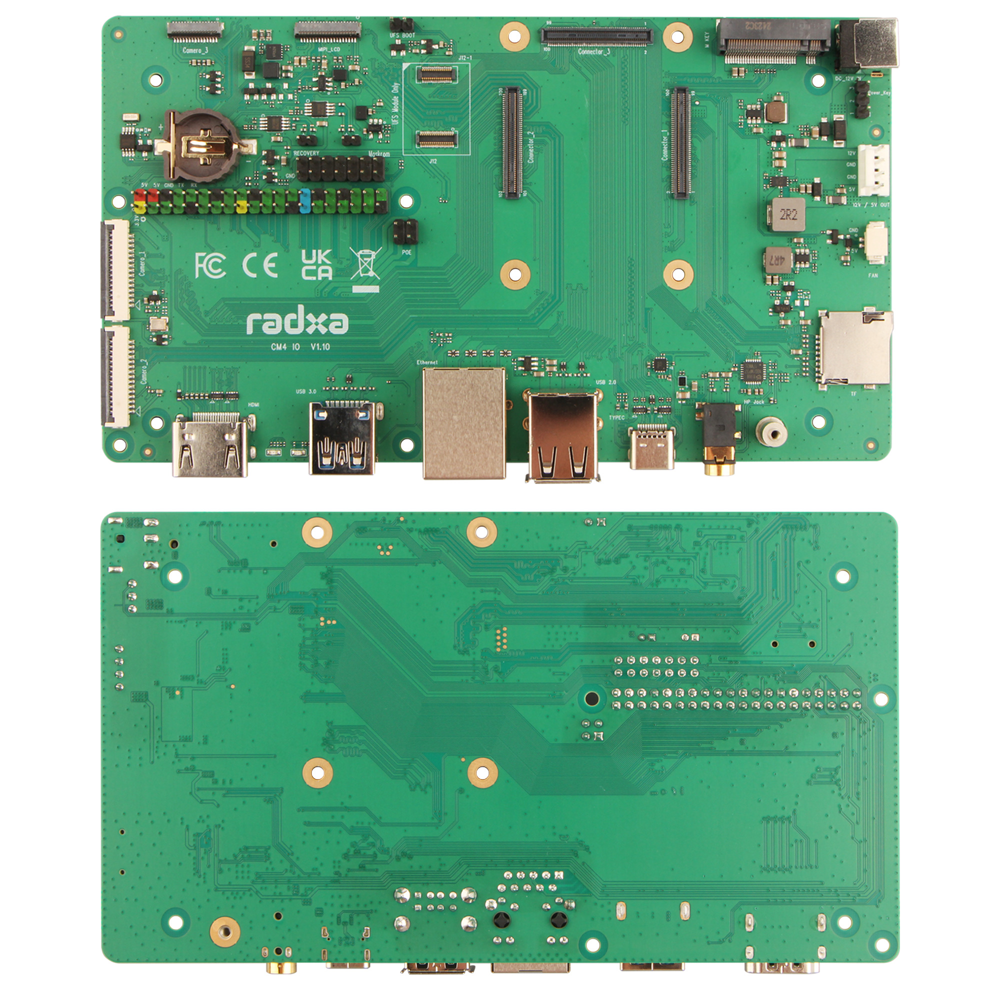

# HW Design for Radxa CM4 IO board

- radxa_cm4_io_board_v1.10.DSN: io board schematic, use Orcad 16.6 or later to view it. You can download a free copy viewer [here](https://www.orcad.com/downloads/orcad-viewer)(Windows only).
- radxa_cm4_io_board_v1.10.pcb: io board layout, use Pads 2.5VX or later to view it. You can find a free copy viewer [here](https://community.sw.siemens.com/s/article/PADS-Viewers)(Windows only).

